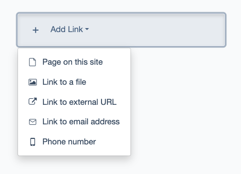
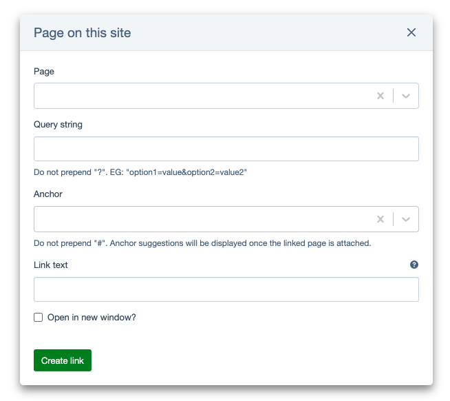
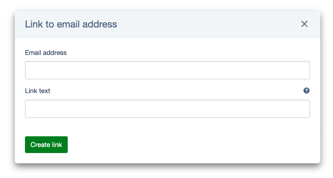
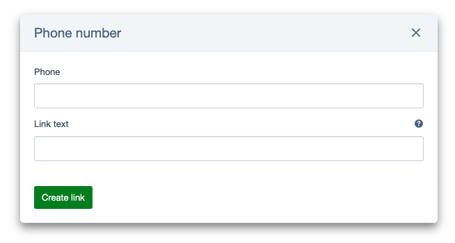
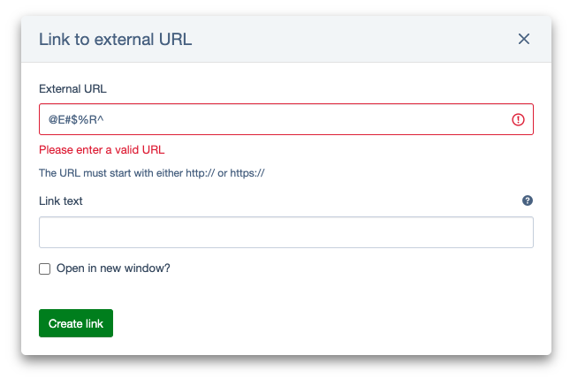
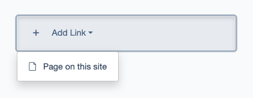

# Link types

The main types of links listed in this section are accessible to users by default. This list may change, potentially expanding if developers introduce additional link types, or shrinking as detailed in the ["Allowed types"](#allowed-types) section.

## Page on this site

This link type enables the creation of a link to a page within the specified website. The form includes the following fields for completion:

- **Page** - This field presents a dropdown menu containing existing pages on the website. Additionally, the input field features an autocomplete function, simplifying the process for users to select the desired page from the provided list. This field is required.
- **Query String** - This field allows you to include a query string in the link. It's handy if you need to perform certain actions when the link is clicked. For instance, it's useful when linking to a search results page for a specific query. This field is optional.
- **Anchor** - A named anchor serves to link to a specific part or section of a page. It must be present on the destination page to appear in the dropdown list. However, this field doesn't provide the functionality to create a new anchors on the linked page itself. This field is optional.
- **Link Text** - This field is designed to specify the title displayed for the link. If left blank, the title of the linked page will be used instead. This field is optional.
- **Open in new window** - This option determine whether the link will open in a new window or tab. This field is optional.

## Link to a file

This link type enables you to provide a link to a file.

- **File** - This field is used to generate a link to a file. The file can either be uploaded at the time of creating the link or selected from existing files. This field is required.
- **Link Text** - This field is designed to specify the title displayed for the link. If left blank, the name of the file will be used instead. This field is optional.
- **Open in new window** - This option determine whether the link will open in a new window or tab. This field is optional.

## Link to external URL

This link type lets you add a link to resources hosted externally from the site.

- **External URL** - This field is designated for entering the URL address of external resources. The provided input undergoes validation to ensure conformity with internet standards for all URL components. This field is required.
- **Link Text** - This field is designed to specify the title displayed for the link. If the title is not specified, the link URL will be used instead. This field is optional.
- **Open in new window** - This option determine whether the link will open in a new window or tab. This field is optional.

## Link to email address

This link type enables you to generate an email link with all essential attributes. Clicking on the link will automatically launch the user's email client and pre-fill the "To" field with a designated email address.

- **Email address** - This field is intended for users to input email address. To ensure compliance with standards, the entered email addresses undergo validation. This field is required.
- **Link Text** - This field is designed to specify the title displayed for the link. If the title is not specified, the email address will be used instead. This field is optional.

## Phone number

This type generates a link with phone number that enables users to simply click on the number and initiate a call, eliminating the need to manually jot down or remember it.

- **Phone** - This field is provided for users to input phone number. The entered data is checked to ensure compliance with standards. This field is required.
- **Link Text** - This field is designed to specify the title displayed for the link. If the title is not specified, the phone number will be used instead. This field is optional.

## Default title

As you may have observed, each link type includes a "Link Text" field. This field is optional. If left empty during link creation, the default title associated with the link type will be used when the page is displayed.

## Validation error

As you can see, the main link fields must be filled out. Additionally, some fields are checked to ensure they meet specific standards, such as the correct format for external link URLs. If there's an error, the field will be highlighted in red, and an error message will prompt the user to make corrections.

## Allowed types

Business logic may impose limitations on the types of links accessible to CMS users, thereby restricting the available selection to a limited list.
For instance, if a particular page allows only links to other pages within the same site, the dropdown menu will exclusively feature the "Page on this site" link type.

