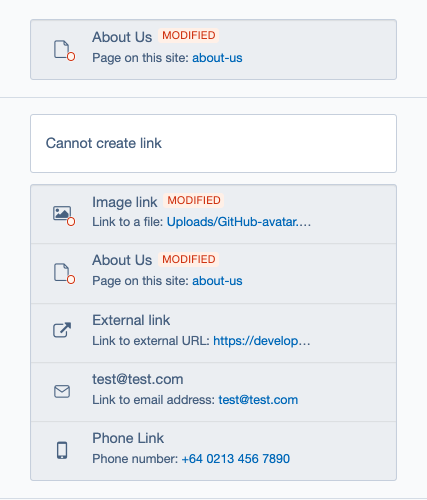
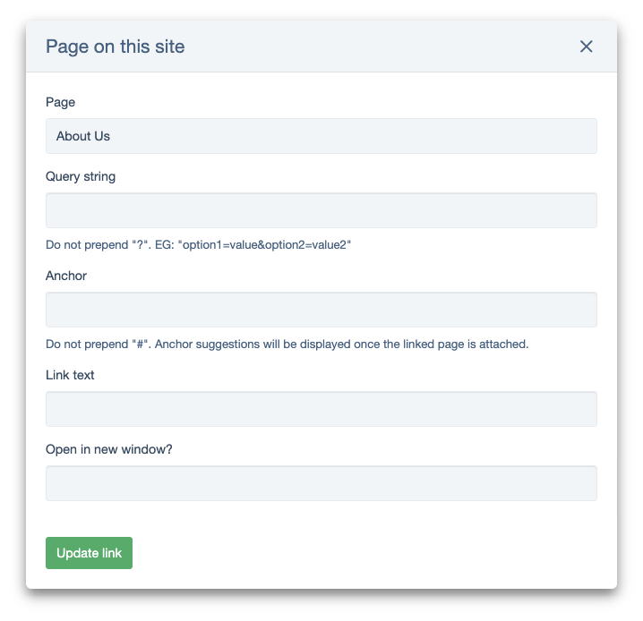
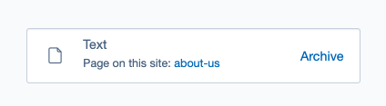
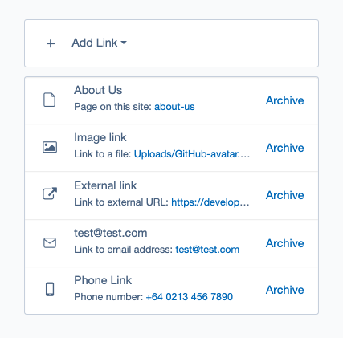
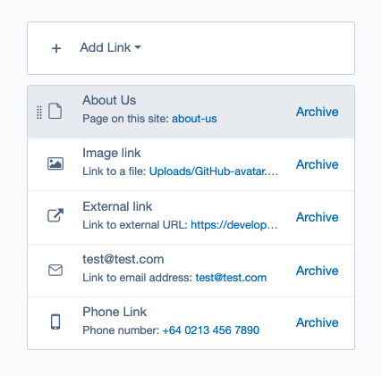
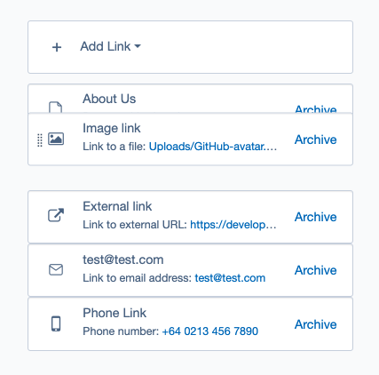
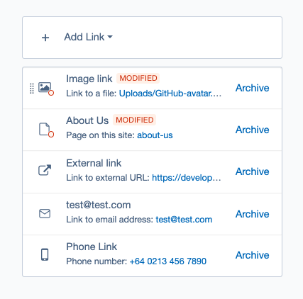
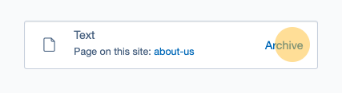
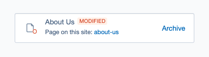

# Using the link field

Previous sections provided fundamental knowledge for creating links. In contrast, this section will delve into the specifics of link field, offering insights into its functionalities like sorting and deletion, essential for effective link management.

The LinkField module offers two primary types of fields: one for managing a single link and the other for managing multiple links. While there are some differences in how these fields operate, let's first outline the key aspects that are common to both types of fields.

- To view more detailed information or make changes to an existing link, click anywhere on the link details. This opens the modal window where adjustments can be made. If no changes are required, you can simply close the modal window.

- Once a new link is created, basic information about it will be displayed in the Link field.

- Any information entered is automatically saved upon the creation of a new link or when you update the link data.

- To publish links, you need to publish a page or data object using the link field.

- Once created, you can modify the link type. To change a link to a different type, you must delete the existing link and create a new one.

## Disabled or read-only links

If a user doesn't have the right permissions for editing a link (usually because they can't edit the page the link is on), editing capabilities for these links will be disabled. This is usually referred to as read-only mode. In read-only mode, links cannot be edited, archived, or reordered - but all of the information about them can be viewed.

The following examples below illustrate the appearance of a link field and modal window when the link is in a read-only state.

## Single link field

The single link field is designed for managing individual links. To create a new link, you can click on the "Add link" button and select the desired link type from the dropdown menu. This action opens a modal window where you can input the necessary information for creating the link. For detailed information about the default link types, please refer to the ["Link types"](./01_links_types.md) section.

## Multi link field

The multi link field functions similarly to the single link field, but with multiple links. You can create various links and easily manage them within a single field. Additionally, they can sort the links as needed. The order of links in the field will be the order they're displayed on the front end.

### Sorting multi link field

Let's explore an example demonstrating how you can arrange created links using the Drag & Drop feature.
When hovering the mouse cursor over a link to be moved, it will visually highlight.

By clicking and holding the left mouse button while over the link, one can drag it to the desired position. After releasing the mouse button, all existing links will adjust accordingly.

New changes will be automatically saved, and modified links will be identified.

## Delete links

You can remove an existing link by clicking on the "Archive" button.

## Version history

Link Field includes versioning support, meaning any changes made are recorded in the change history. Additionally, a badge will appear to indicate interference whenever modifications are made.

