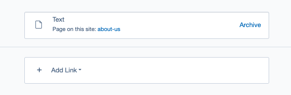

# Managing links in the CMS

## Before we begin
>
> [!IMPORTANT]
> Make sure that your Silverstripe CMS installation has the [LinkField](https://packagist.org/packages/silverstripe/linkfield) module installed.

## Introduction

In this section, we will show the process of managing links using the LinkField module. This module provides a clean interface for creating and managing links in the CMS.

There are two main types of link field: one for managing a single link and another for managing multiple links. Each type of Link field will be discussed in the ["Using the link field"](./02_work_with_link_field.md) section.

The module streamlines the link creation process by providing a user-friendly form that includes all essential fields necessary for link management.

An important aspect to highlight is that newly generated links are automatically stored, eliminating the need for the user to save the entire page. Moreover, the link types inherently support versioning, ensuring that any modifications made within Link field are traceable in the change history.

## User manual

[CHILDREN includeFolders]
